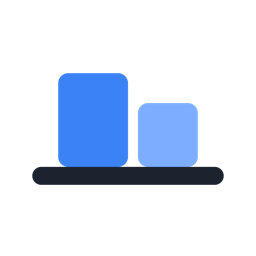

<p align="center">
	
</p>

<h1 align="center">Shelf</h1>

<p align="center">
	Bildschirmaufnahmen und Screenshots für den Mac. Screenshots landen auf einem
	Regal am Bildschirmrand und werden von dort in andere Apps gezogen.
</p>

---

Shelf ist ein eigenständiger Fork von [Cap](https://github.com/CapSoftware/Cap).
Der Unterschied zum Original:

- **Screenshots im Overlay.** Neue Einstellung „Nach einem Screenshot": Editor
  öffnen, oder die Aufnahme direkt als Karte im Overlay ablegen.
- **Karten herausziehen.** Eine Screenshot-Karte lässt sich mit der Maus in jede
  andere App ziehen, ohne den Umweg über den Finder.
- **Läuft auf zwei Monitoren.** Karten auf einem Monitor mit anderer Skalierung
  waren im Original nicht anklickbar, der Treffertest rechnet jetzt in logischen
  Punkten.
- **Stürzt nicht mehr ab.** Ein Fehler in Tauri legte die App jedes Mal lahm,
  sobald sich das Overlay öffnete. Details im `CHANGELOG.md`.

## Entwickeln

Gebraucht werden Node mit pnpm, Rust (Toolchain steht in `rust-toolchain.toml`)
und die Xcode Command Line Tools.

```sh
cp .env.example .env    # einmalig, ohne diese Datei brechen die Build-Scripts ab
pnpm install
pnpm dev:desktop        # Vite plus Tauri, startet die App
```

In der `.env` stehen keine Schlüssel. Shelf ist rein lokal, es gibt keine Konten
und keinen Server. Die Datei existiert nur, weil einige Scripts sie per
`dotenv -e .env` einlesen.

Nur einzelne Teile:

```sh
pnpm --dir apps/desktop localdev                    # nur der Vite-Server (Port 3002)
cargo build --no-default-features -p cap-desktop    # nur die Desktop-App
./target/debug/cap-desktop                          # Binary starten, Vite muss laufen
```

Fertige App bauen (signiert, macOS):

```sh
APPLE_SIGNING_IDENTITY="Developer ID Application: <dein Name> (<TeamID>)" pnpm tauri:build
```

## Wo liegt was

| Was | Wo |
| --- | --- |
| Desktop-App (Rust) | `apps/desktop/src-tauri/` |
| Desktop-Oberfläche (SolidJS) | `apps/desktop/src/` |
| Aufnahme, Rendering, Projekt | `crates/` |
| Gepatchte Fremd-Crates | `vendor/` |
| Verlauf und offene Punkte | `CHANGELOG.md` |
| Regeln für KI-Agents | `CLAUDE.md`, `AGENTS.md` |

Einstellungen und Aufnahmen liegen unter
`~/Library/Application Support/de.shelf.desktop/`, Logs unter
`~/Library/Logs/de.shelf.desktop/`.

## Lizenz

AGPLv3, wie das Original. Teile stehen unter MIT, siehe `LICENSE` und
`licenses/`. Die Copyright-Zeilen von Cap Software bleiben dort stehen, das
verlangt die Lizenz. Wer die App weitergibt, muss den Quellcode mitliefern.
